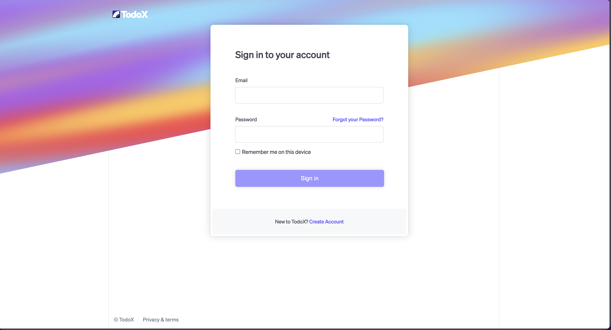
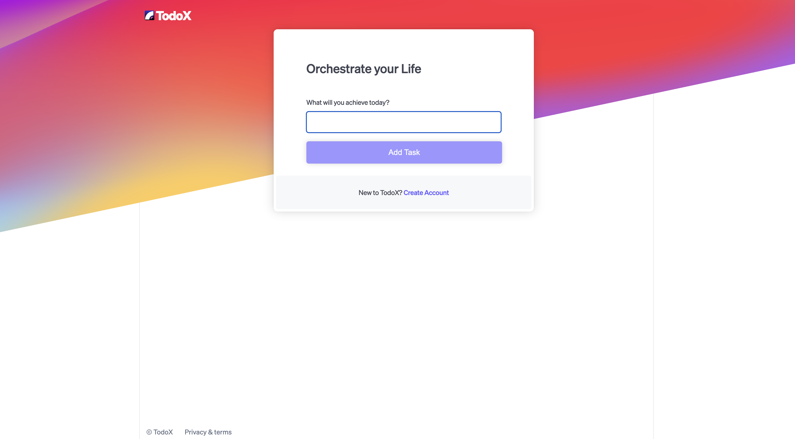
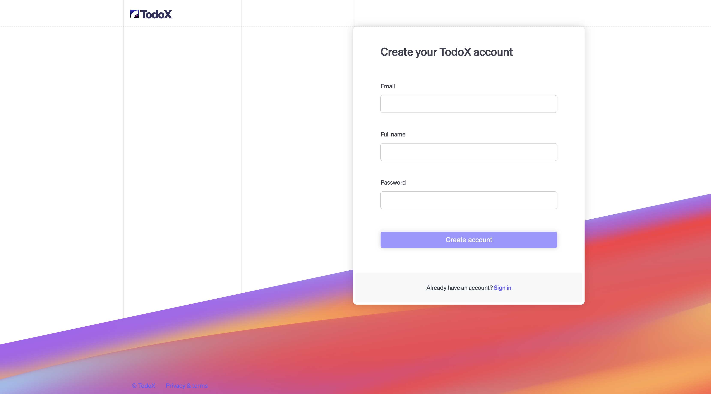
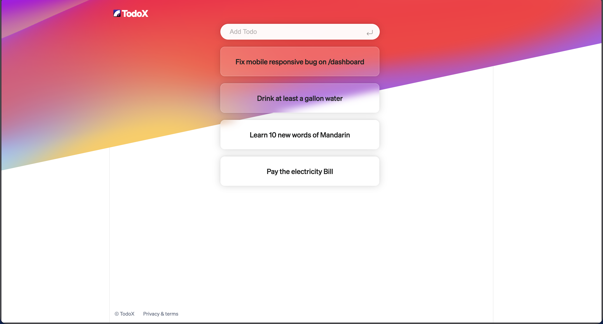

# 📝 TodoX


> A robust, full-stack Task Management System designed for efficiency and scalability.

TodoX is a modern productivity application that allows users to securely manage their daily tasks. Built with a **RESTful API** architecture, it features secure user authentication, persistent database storage, and a responsive frontend interface.

---

## 📸 Screenshots

| **Login Interface** | **User Dashboard** |
|:---:|:---:|
|  |  |
| *Secure Authentication* | *Fully dynamic workflow* |

| **Sign Up Interface** | **Todos** |
|:---:|:---:|
|  |  |
| *Easy User Registration* | *Manage your tasks efficiently* |


---

## ✨ Key Features

* **🔐 Secure Authentication:** Implemented user login and registration logic using `auth.js` middleware to protect user data.
* **🛠 Modular Architecture:** Routes are separated from logic (`/routes` folder), following MVC principles for cleaner code.
* **💾 Persistent Storage:** Utilizes **MongoDB** with **Mongoose** schemas (`db.js`) to store users and tasks reliably.
* **⚡ RESTful API:** Organized endpoints for standard CRUD operations (Create, Read, Update, Delete) on tasks.
* **📱 Responsive Design:** Frontend served via static assets, optimized for both desktop and mobile devices.

---

## 🛠 Tech Stack

* **Backend:** Node.js, Express.js
* **Database:** MongoDB, Mongoose ODM
* **Frontend:** HTML5, CSS3, JavaScript (Vanilla)
* **Tools:** Git, Postman (for API testing), Dotenv (for environment variables)

---

## 🚀 Getting Started

Follow these steps to run the project locally on your machine.

### Prerequisites
* Node.js installed
* MongoDB installed locally OR a MongoDB Atlas connection string

### Installation

1.  **Clone the repository**
    ```bash
    git clone [https://github.com/22Arjun/TodoX.git](https://github.com/22Arjun/TodoX.git)
    cd TodoX
    ```

2.  **Install dependencies**
    ```bash
    npm install
    ```

3.  **Configure Environment Variables**
    Create a `.env` file in the root directory and add your credentials:
    ```env
    PORT=3000
    MONGO_URI=your_mongodb_connection_string
    SESSION_SECRET=your_secret_key
    ```

4.  **Run the application**
    ```bash
    # For development (using nodemon if installed)
    npm run dev

    # Standard start
    node app.js
    ```

5.  **Open in Browser**
    Visit `http://localhost:3000`

---

## 📂 Project Structure

```bash
TodoX/
├── public/             # Static files (CSS, client-side JS, images)
├── routes/             # API routes (User routes, Todo routes)
├── views/              # HTML/EJS templates
├── app.js              # Main application entry point
├── auth.js             # Authentication middleware logic
├── db.js               # Database connection setup
├── .env                # Environment variables (not pushed to GitHub)
└── package.json        # Project dependencies
```

---

## 🔮 Future Improvements

- [ ] **Dark Mode:** Add a toggle for dark/light themes.
- [ ] **Drag & Drop:** Implement task reordering using a library like SortableJS.
- [ ] **Email Notifications:** Add automated email reminders for due dates.
- [ ] **Social Login:** Integrate Google/GitHub OAuth for faster sign-ins.

---

## 🤝 Contributing

Contributions are welcome! Please feel free to submit a Pull Request.

1.  **Fork** the project on GitHub.
2.  **Clone** your fork to your local machine.
3.  **Create a new branch**:
    ```bash
    git checkout -b feature/AmazingFeature
    ```
4.  **Commit your changes**:
    ```bash
    git commit -m 'Add some AmazingFeature'
    ```
5.  **Push to the branch**:
    ```bash
    git push origin feature/AmazingFeature
    ```
6.  **Open a Pull Request** on the main repository.

---

## 👤 Author

**Arjun Singh Bhadauriya**

* [**GitHub Profile**](https://github.com/22Arjun)
* [**X Profile**] (https://x.com/ArjunSBhadoriya)
* [**LinkedIn Profile**](https://linkedin.com/in/arjun-singh-bhadauriya)
* [**Email**](mailto:arjun22august@gmail.com)

---

## 📝 License

This project is licensed under the MIT License - see the [LICENSE](LICENSE) file for details.
